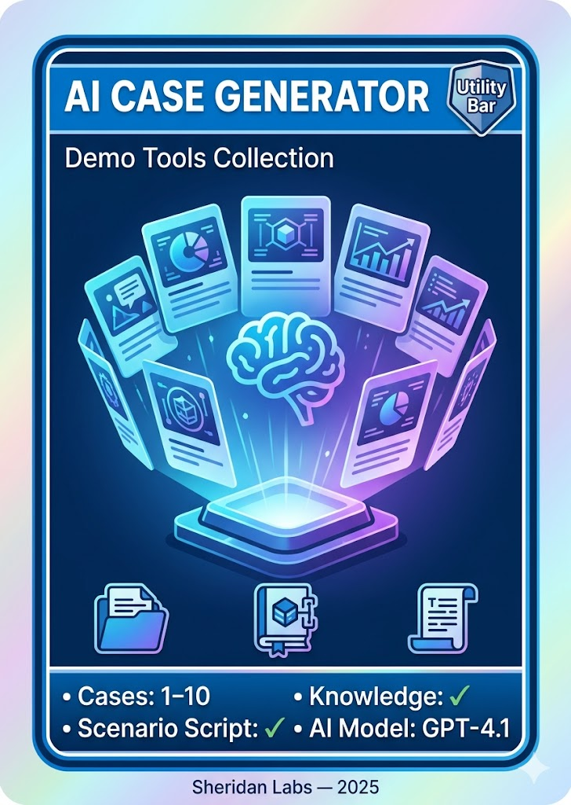

# AI Case Generator Pack

<p align="center">
  
</p>

This pack deploys the **AI Case Generator** — a Utility Bar LWC that uses Einstein LLM to generate realistic Service Cloud cases, Knowledge articles, and a presenter-ready demo scenario script, all tailored to a chosen company and industry.

---

## Contents

| Component | Type | Description |
|-----------|------|-------------|
| aiCaseGenerator | LWC | Utility Bar component with form input, results display, and demo scenario card. |
| AICaseGeneratorController | Apex | Controller handling contact lookup, Einstein LLM calls, case/article creation, and scenario generation. |
| Case_Generator | GenAI Prompt Template | Generates realistic case JSON (subject, description, priority, type, origin) via GPT-4.1. |
| Knowledge_Article_Generation_Template | GenAI Prompt Template | Produces HTML knowledge articles with troubleshooting steps. |
| Demo_Scenario_Story_Generator | GenAI Prompt Template | Creates a Markdown demo script tying cases, contact, and knowledge into a narrative. |

---

## Prerequisites

- **Service Cloud** (Case object)
- **Einstein Generative AI** enabled (Einstein for Sales/Service or Einstein 1 license) — the component works without it using mock data, but AI features require it
- **Knowledge** enabled (optional — only needed for the Knowledge article feature)
- At least one **Contact** record in the org

---

## Deploy this pack

This pack is self-contained with its own `sfdx-project.json`. From the **Demo Packs** directory:

```bash
cd "AI Case Generator Pack"
sf project deploy start --source-dir force-app --target-org YOUR_ORG_ALIAS
```

Or use the installer script from the Demo Packs root:

```bash
./scripts/install-pack.sh
```

---

## Post-deploy setup

1. **Add to Utility Bar** — Open **Setup → App Manager**, edit the app you demo with (e.g. Service Console), go to **Utility Items**, and add **AI Case Generator**.
2. **Verify Prompt Templates** — Go to **Setup → Einstein → Prompt Builder** and confirm the three templates are active. If they show as Draft, activate them.
3. **Test It** — Open the Utility Bar panel, enter a company name and industry, and click **Generate Cases**.

---

## Features

| Feature | Description |
|---------|-------------|
| **AI Case Generation** | Generates 1–10 realistic cases tailored to a company and industry using Einstein Prompt Templates. Falls back to industry-specific mock templates when Einstein is unavailable. |
| **Knowledge Article** | Optionally creates a rich HTML Knowledge article with troubleshooting steps and prevention tips. |
| **Demo Scenario Script** | Einstein produces a Markdown-formatted demo story with talking points. Collapsible card with a **Copy Script** button. |
| **Random Contact Assignment** | Picks a random existing Contact and assigns all generated cases — great for demoing the 360-degree customer view. |
