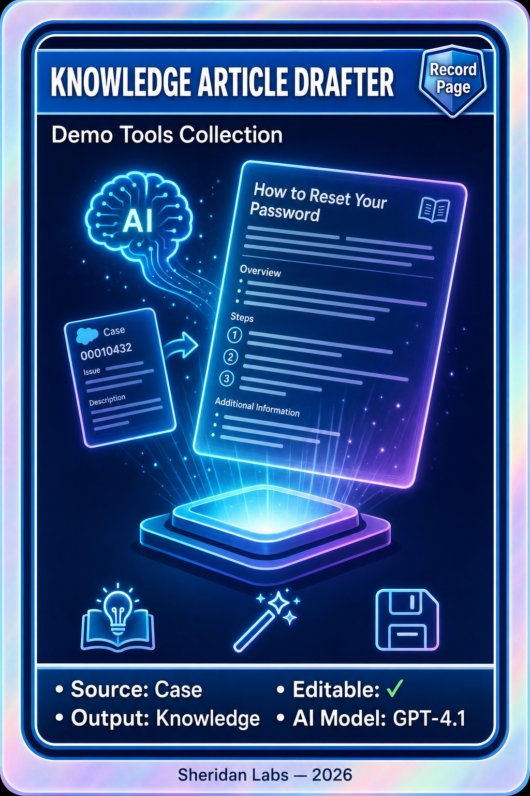

# Knowledge Article Drafter Pack

<p align="center">
  
</p>

This pack deploys the **Knowledge Article Drafter** — a Case record-page LWC that uses Einstein Generative AI to draft a complete, formatted Knowledge article from the current Case and its account's case history. The agent (or user) reviews and edits the title, summary, and rich-text body, then saves it as a **Draft `Knowledge__kav`** article in one click.

---

## Contents

| Component | Type | Description |
|-----------|------|-------------|
| knowledgeArticleDrafter | LWC | Case record-page component: generates a draft, lets the user edit title/summary/rich-text content, and saves it as a Knowledge draft. Exposes configurable `cardTitle`, `contentFieldApiName`, and `articleLanguage` properties in App Builder. |
| KnowledgeArticleDraftController | Apex | Loads the Case + related account cases, invokes the prompt template via `ConnectApi.EinsteinLLM`, parses the JSON response, and inserts the reviewed draft as a `Knowledge__kav`. Mockable/test-safe. |
| KnowledgeArticleDraftControllerTest | Apex | Unit tests for JSON parsing, case summarization helpers, and article creation. |
| Knowledge_Article_Generation_Template | GenAI Prompt Template | Flex template that produces a `{title, summary, content}` JSON payload with professional inline-styled HTML, tailored to the customer and industry (GPT-4.1). |
| Knowledge_Article_Drafter | Permission Set | Grants Apex class access to the controller. |

---

## Prerequisites

- **Salesforce Knowledge** enabled, with **Lightning Knowledge** article type `Knowledge__kav` available.
- A **rich-text field** on `Knowledge__kav` to receive the generated HTML body. The component defaults to **`FAQ_Answer__c`** — if your org uses a different field, set the **Knowledge Content Field API Name** property in App Builder (see Post-deploy). No matching field is required to *generate* a draft, only to *save* the body.
- **Einstein Generative AI** enabled (Einstein for Service or Einstein 1). Prompt Builder must be available.
- **Service Cloud** (Case object) with at least one Case; the richest output comes from a Case whose Account has related cases and an Industry set.

---

## Deploy this pack

This pack is self-contained with its own `sfdx-project.json`. From the **Demo Packs** directory:

```bash
cd "Knowledge Article Drafter Pack"
sf project deploy start --source-dir force-app --target-org YOUR_ORG_ALIAS
```

Or use the installer script from the Demo Packs root:

```bash
./scripts/install-pack.sh
```

---

## Post-deploy setup

1. **Assign the permission set** — `sf org assign permset --name Knowledge_Article_Drafter` (or **Setup → Permission Sets → Knowledge Article Drafter → Manage Assignments**).
2. **Verify the prompt template** — **Setup → Einstein → Prompt Builder** and confirm **Knowledge Article Generation Template** is **Published/Active**. If it shows as Draft, activate it.
3. **Confirm the content field** — Make sure your `Knowledge__kav` has a rich-text field for the body. If it isn't `FAQ_Answer__c`, note the API name for the next step.
4. **Add the component to the Case page** — Open a Case → **Setup (gear) → Edit Page**, drag **knowledgeArticleDrafter** onto the Lightning record page. Set:
   - **Card Title** (optional label)
   - **Knowledge Content Field API Name** — the rich-text field on `Knowledge__kav` (default `FAQ_Answer__c`)
   - **Article Language** — e.g. `en_US`
5. **Test it** — Open a Case, click **Generate Draft**, review/edit the title, summary, and body, then **Save as Draft Article**. The new Knowledge draft opens automatically.

---

## How it works

| Step | What happens |
|------|--------------|
| **Gather context** | The controller reads the Case (subject, description, priority, type, reason) plus up to 25 related cases on the same Account, and the Account name + industry. |
| **Generate** | Those values are passed as `customerName`, `industry`, `additionalDetails`, and `casesSummary` inputs to the **Knowledge Article Generation Template**, which returns a `{title, summary, content}` JSON object with inline-styled HTML. |
| **Review** | The LWC populates editable Title, Summary, and rich-text Content fields so the user can refine the draft before publishing. |
| **Save** | The reviewed draft is inserted as a `Knowledge__kav` in **Draft** status (in `USER_MODE`), and the component navigates to the new article. |

---

## Notes

- **AI required to generate, not to review/save.** Generation calls Einstein; the review + save flow is standard Knowledge DML, so you can always hand-edit before publishing.
- **Content field is configurable.** The body is written to whatever rich-text field you point `contentFieldApiName` at, so the pack adapts to any Lightning Knowledge article type.
- The prompt template ships **Published** with an `activeVersionIdentifier`; if your org rejects the identifier on deploy, open the template in Prompt Builder and re-save/activate.
