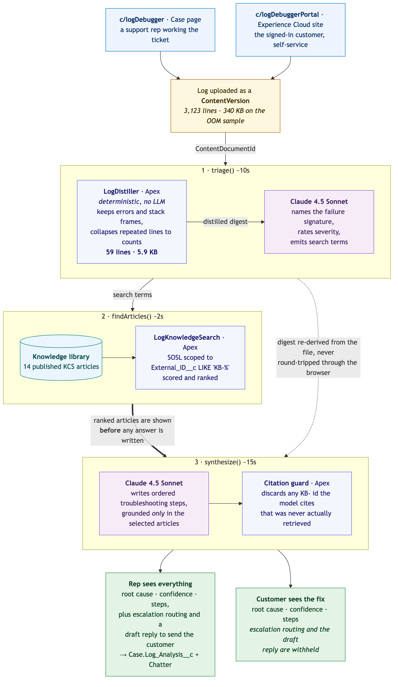

# Log Debugger Pack



This pack deploys the **Log Debugger** — a pair of LWCs that take a raw cluster or job log, distil it, and hand it to **Claude** through the Models API to produce a root cause and cited troubleshooting steps, grounded in a library of Knowledge articles rather than in whatever the model happens to remember.

The same pipeline serves two audiences. A support rep gets the full picture on the **Case record page**, including escalation guidance and a drafted customer reply, and can write the analysis back to the Case in one click. A signed-in customer gets the trimmed version on an **Experience Cloud site** — the same root cause and the same steps, with the internal-only material withheld.

---

## Contents

| Component                | Type           | Description                                                                                                                                                                       |
| ------------------------ | -------------- | --------------------------------------------------------------------------------------------------------------------------------------------------------------------------------- |
| `logDebugger`            | LWC            | Case record-page component. Upload a log, watch the three-stage pipeline run, then save the analysis to the Case and post it to Chatter. Shows escalation and a draft reply.      |
| `logDebuggerPortal`      | LWC            | Experience Cloud component for signed-in customers. Same analysis, trimmed output — no escalation routing, no rep reply draft. `heading` and `introduction` are set in Experience Builder. |
| `logDebuggerCore`        | LWC (internal) | Shared phase model, formatting, and severity/confidence theming, so the two surfaces cannot drift apart.                                                                          |
| `logDebuggerStyles`      | LWC (internal) | Shared SLDS 2 styling, imported by both components.                                                                                                                               |
| `LogDebuggerController`  | Apex           | The three `@AuraEnabled` entry points — `triage`, `findArticles`, `synthesize` — plus `saveToCase`.                                                                               |
| `LogDistiller`           | Apex           | Reduces a multi-megabyte log to the lines that matter, keeping the transaction inside the heap limit and the prompt inside a sane token count.                                     |
| `LogKnowledgeSearch`     | Apex           | SOSL/SOQL retrieval over `Knowledge__kav`, scoped to `External_ID__c LIKE 'KB-%'` so it searches the troubleshooting library and not the org's other articles.                    |
| `LogClaudeService`       | Apex           | Wraps `aiplatform.ModelsAPI`. Defaults to **Claude Sonnet 4.5**; Opus 4.5 is a one-line switch.                                                                                   |
| `LogAnalysis`            | Apex           | DTOs shared across the pipeline and returned to the LWCs.                                                                                                                         |
| `LogTestData`            | Apex           | Test fixtures.                                                                                                                                                                    |
| `Case.Log_Analysis__c`   | Custom Field   | Long text area the rep-facing component writes the finished analysis into.                                                                                                        |
| `Knowledge__kav` fields  | Custom Fields  | `External_ID__c` for scoping, plus the four `KCSArticle_*` rich text fields the articles are written into and retrieval reads back. Created where missing; left alone where they already exist. |
| `Log_Debugger`           | Permission Set | Rep access: the Apex pipeline, the Case field, and read on the Knowledge fields retrieval touches.                                                                                |
| `Log_Debugger_Portal`    | Permission Set | Customer access: the Apex pipeline and Knowledge reads only. Deliberately no access to the Case field.                                                                            |
| `data/knowledge-articles.json` | Data     | 14 troubleshooting articles (`KB-001`–`KB-014`) covering driver OOM, Delta concurrent writes, catalog permissions, shuffle failures, and friends.                                 |
| `sample-logs/`           | Data           | Three realistic failure logs to demo with, 58 KB to 348 KB.                                                                                                                       |

Five Apex test classes ship with the pack and run as part of any validated deploy.

---

## Prerequisites

- **Einstein Generative AI** enabled, with the **Anthropic Claude** models available through the Models API. The pack calls `aiplatform.ModelsAPI` directly, so no prompt template setup is needed — but the org must be able to reach `sfdc_ai__DefaultBedrockAnthropicClaude45Sonnet`.
- **Salesforce Knowledge** (Lightning Knowledge, `Knowledge__kav`) enabled. The five custom fields the pack needs on the article type ship with it, so there is nothing to create by hand.
- **Node.js** — only for the Knowledge loader script, not for the deploy itself.
- **An Experience Cloud site** if you want the customer-facing half. An **Aura** site is required: `lightning-file-upload` is not supported on LWR sites.

---

## Deploy this pack

This pack is self-contained with its own `sfdx-project.json`. From the **Demo Packs** directory:

```bash
cd "Log Debugger Pack"
sf project deploy start --source-dir force-app --target-org YOUR_ORG_ALIAS
```

Or use the installer script from the Demo Packs root:

```bash
./scripts/install-pack.sh
```

---

## Post-deploy setup

1. **Assign the permission sets.** Reps get one, customers the other:

   ```bash
   sf org assign permset --name Log_Debugger --target-org YOUR_ORG_ALIAS
   sf org assign permset --name Log_Debugger_Portal --target-org YOUR_ORG_ALIAS --on-behalf-of COMMUNITY_USERNAME
   ```

2. **Load the troubleshooting library.** Without it the retrieval step finds nothing and the analysis has nothing to cite:

   ```bash
   ./scripts/loadKnowledge.sh YOUR_ORG_ALIAS
   ```

   The script resolves a Knowledge record type, imports the 14 articles as drafts via the Bulk API, and publishes them. Re-running is safe — articles already present are skipped. To reset the library, run `scripts/apex/deleteKnowledge.apex`.

3. **Add the rep component to the Case page.** Open a Case → **Setup (gear) → Edit Page**, drag **Log Debugger** on, and save. Add `Log Analysis` to the page layout too if you want the saved output visible on the record.

4. **Add the customer component to your Experience Cloud site.** Open the site in **Experience Builder**, drag **Log Debugger (Self-Service)** onto a page, and set **Heading** and **Introduction** to taste. Publish. Make sure the site's members have the `Log_Debugger_Portal` permission set.

5. **Test it.** Open a Case, upload one of the files from `sample-logs/`, and click through. `driver-oom-cluster-0714.log` is the best first demo: 348 KB and about 3,100 lines in, a two-line root cause out.

---

## How it works

| Step             | What happens                                                                                                                                                                                                                            |
| ---------------- | ---------------------------------------------------------------------------------------------------------------------------------------------------------------------------------------------------------------------------------------- |
| **Upload**       | The log is saved as a `ContentVersion`. On a Case it is linked to the record; on the portal it stays private to the customer who uploaded it.                                                                                            |
| **Distil**       | `LogDistiller` strips the log down to stack traces, error lines, and surrounding context. The component shows the before/after line and byte counts, which is worth pointing at in a demo — this is what keeps a 350 KB log inside Apex heap and inside a reasonable prompt. |
| **Triage**       | Claude reads the distilled log and returns an error signature, the failing component, a severity, and the search terms to look the problem up with. Classifying first is what makes the retrieval good.                                  |
| **Retrieve**     | `LogKnowledgeSearch` runs those terms through SOSL and SOQL against the published `KB-` articles and ranks the hits. This is the grounding step, and it runs `WITH USER_MODE`.                                                            |
| **Synthesize**   | The top articles go back to Claude with the distilled log, and it returns a root cause, a confidence level, numbered steps with commands, and citations back to the article IDs it actually used.                                        |
| **Act**          | The rep saves the analysis to `Case.Log_Analysis__c` and posts it to Chatter, or copies the drafted reply. The customer just gets the steps.                                                                                             |

---

## Notes

- **Grounded, and it shows.** Every analysis cites the `KB-` articles behind it. Ask it about something the library does not cover and it says so and drops its confidence, rather than inventing a fix — which is the point worth making in front of a customer.
- **Claude is explicit, not incidental.** The model is named in `LogClaudeService.MODEL_SONNET_45`. Switch `modelName` to `MODEL_OPUS_45` for a heavier model on the same pipeline.
- **The two surfaces share one pipeline.** Both components call the same three Apex methods; the difference is entirely in what the customer-facing template renders. There is no second, weaker analysis for customers.
- **The Knowledge fields ship with the pack, and are safe to redeploy.** `External_ID__c` and the four `KCSArticle_*` fields are defined to match the standard SDO article type exactly, so an org that already has them reports them unchanged on deploy rather than having its Knowledge schema quietly re-shaped.
- **The article prefix is the scoping mechanism.** Retrieval is filtered on `External_ID__c LIKE 'KB-%'`, so the pack coexists with an org's existing Knowledge base instead of searching across it. Change the prefix in `LogKnowledgeSearch` and `data/knowledge-articles.json` together if you need to.
- **Sample logs are generated.** `node scripts/generateSampleLogs.js` rebuilds all three if you want different timestamps, cluster IDs, or failure shapes.
- **Experience Cloud needs an Aura site.** LWR does not support `lightning-file-upload`, so the portal component has nowhere to take the file.
