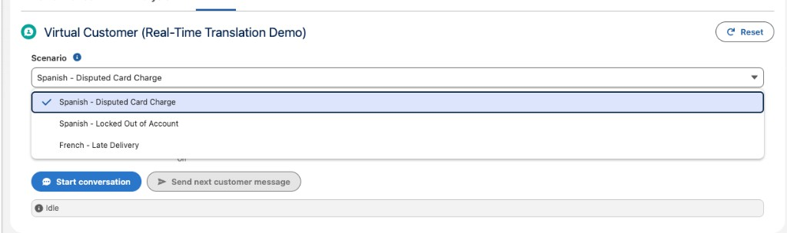

# Real-Time Translation Pack

<p align="center">
  
</p>

This pack deploys the **Virtual Customer** — a Lightning Web Component that simulates a real customer messaging your contact center. It sends genuine inbound messages into a live **Messaging for In-App & Web (MIAW)** session so you can demo two stories from one tool:

- **Real-Time Conversation Translation** — the customer messages in Spanish or French and your org translates it for the human agent live.
- **Agentforce** — the same conversation can instead be answered by an **Agentforce Service Agent**, and after a few turns the customer asks for a human, triggering the agent's **transfer-to-human escalation**.

Because the messages are real inbound conversation entries, the agent's replies (human *or* Agentforce) flow back into the component automatically.

---

## Contents

| Component | Type | Description |
|-----------|------|-------------|
| `sdo_virtualCustomer` | LWC | Chat UI: pick a conversation route + scenario, start the conversation, auto-respond after the agent replies, and watch the transcript. Exposed to App / Home / Record pages and the Utility Bar. |
| `sdo_VirtualCustomerCtrl` | Apex | Drives the MIAW inbound REST API (access token, create conversation, send message, read agent entries), links a Contact to the session, generates dynamic customer turns via the Models API, and defines the routes + scenarios. |
| `sdo_VirtualCustomerCtrl_Test` | Apex | Test class (mocks the MIAW callouts). |

---

## Prerequisites

- **Messaging for In-App & Web** with an **API (Custom Client)** deployment that is **Published**. The pack ships with two routes (see *Configure your routes* below); each needs a deployment + messaging channel in your org.
- **Real-Time Conversation Translation** enabled (for the translation story — customer and agent must speak different languages for it to engage).
- **An Agentforce Service Agent connected to a messaging channel** (for the Agentforce story), with a transfer-to-human / escalation action enabled.
- **Einstein Generative AI** (Models API access) — required only for the "Dynamic AI follow-ups" toggle. Scripted scenarios work without it.
- At least one **Contact with a phone number** (the session is linked to a random demo contact each run).
- A **Remote Site Setting / Trusted URL** for your org's `*.my.salesforce-scrt.com` host so the MIAW callouts succeed.

---

## Deploy this pack

This pack is self-contained with its own `sfdx-project.json`. From the **Demo Packs** directory:

```bash
cd "Real-Time Translation Pack"
sf project deploy start --source-dir force-app --target-org YOUR_ORG_ALIAS
```

Or use the installer script from the Demo Packs root:

```bash
./scripts/install-pack.sh
```

---

## Configure your routes

The two conversation routes are defined in **one place** — the `getRoutes()` method of `sdo_VirtualCustomerCtrl`. Each route maps to an embedded service deployment (`esDeveloperName`) and the messaging channel its sessions land on (`channelDevName`). Update these to match your org:

```apex
routes.add(new Route('Human Agent (Real-Time Translation)', 'RTT_New', 'RTT', false));
routes.add(new Route('Agentforce Service Agent', 'SDO_Messaging_API', 'Messaging_for_In_App_Web', true));
```

- `esDeveloperName` — the API (Custom Client) deployment developer name.
- `channelDevName` — the `MessagingChannel` developer name those sessions are created on (used to locate the live session and link the contact).
- `agentforce = true` — shows the escalation toggle and enables the "ask for a human after the 3rd turn" behavior.

---

## Post-deploy setup

1. **Add the component** — In Lightning App Builder, drop **Virtual Customer (Translation Demo)** onto an App/Home/Record page, or add it to the **Utility Bar** of your service app.
2. **Set your routes** — Edit `getRoutes()` (above) so the deployment + channel names match your org, then redeploy the Apex class.
3. **Remote Site Setting** — If callouts fail, add a Remote Site / Trusted URL for `https://<your-mydomain>.my.salesforce-scrt.com`.
4. **Open it side-by-side** — Run the agent console (or Agentforce) in one window and this component in another, then **Start conversation**.

---

## Features

| Feature | Description |
|---------|-------------|
| **Conversation route picker** | Switch between the human-agent (translation) deployment and the Agentforce deployment. |
| **Scenarios** | Built-in Spanish, French, and English scenarios (disputed charge, account lockout, late delivery, service outage, plan upgrade, damaged item return), each with a persona and scripted opening lines. |
| **Dynamic AI follow-ups** | Opens with the scenario's scripted line, then the Models API generates each follow-up live in the scenario's language, reacting to the agent. |
| **Auto-respond** | After the agent replies, the customer automatically sends its next turn. |
| **Auto-escalation (Agentforce route)** | After the 3rd customer turn, the customer sends a localized "I'd like a human representative" message to trigger the agent's transfer-to-human action. |
| **Live contact linking** | A random demo Contact (with a phone) is linked to the messaging session so the session shows a real customer. |

---

## Disclaimer

For demos and labs only. Not an official Salesforce product.
