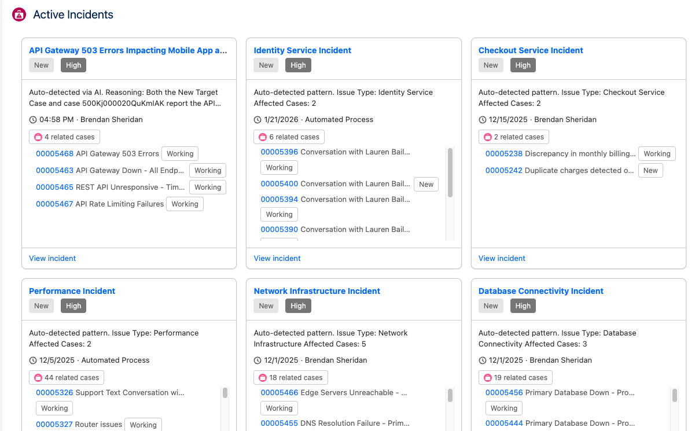

# Incident Dashboard

A Lightning Web Component that displays an **Active Incidents** dashboard—a grid of cards showing open Service Cloud Incidents and their related Cases.

## Screenshot



*The dashboard shows active incidents in a grid of cards, each with status, description, related case count, and links to the incident and its cases.*

## What It Does

- **Lists active incidents** — Up to 50 open Incidents (`Status != 'Closed'`), ordered by creation date.
- **Shows related cases** — Each card lists Cases linked to that Incident via **CaseRelatedIssue** (CaseId + RelatedIssueId).
- **Card details** — Subject, truncated description, status and priority badges, created date, owner, and links to the Incident and each Case record.
- **Empty / loading states** — Handles “No active incidents” and a loading spinner; shows errors from the Apex controller when present.

## Where You Can Use It

The component is exposed for:

- **Lightning App Page** (`lightning__AppPage`)
- **Home Page** (`lightning__HomePage`)

Add it via **App Builder** (Lightning App Builder or similar) and place it on a Home page or an app page where you want the incident dashboard.

## Dependencies

### Apex: IncidentDashboardController

The LWC uses a single **cacheable** Apex method:

- **`IncidentDashboardController.getActiveIncidentsWithCases()`** — Returns a list of `IncidentWithCasesWrapper`, each containing Incident fields (Id, Subject, Description, Status, Priority, CreatedDate, OwnerId, Owner.Name) and a list of `CaseSummaryWrapper` (Id, CaseNumber, Subject, Status, Priority) for related Cases.

The controller queries:

- **Incident** — open incidents only, limit 50.
- **CaseRelatedIssue** — to map Incident Id → Case Ids.
- **Case** — to populate case number, subject, status, priority for each related case.

This package includes the **IncidentDashboardController** Apex class (and its meta) in the `classes/` folder. Deploy it together with the LWC to your org.

### Salesforce Objects

- **Incident** (standard Service Cloud object)
- **CaseRelatedIssue** (standard; links Case to Incident via CaseId and RelatedIssueId)
- **Case** (standard)

No custom fields are required on Incident or Case for this LWC.

## Deployment

Deploy the LWC and the Apex controller from this folder. For a Salesforce DX project you would place:

- `incidentDashboard.js`, `incidentDashboard.html`, `incidentDashboard.css`, `incidentDashboard.js-meta.xml` under `force-app/main/default/lwc/incidentDashboard/`
- `IncidentDashboardController.cls` and `IncidentDashboardController.cls-meta.xml` under `force-app/main/default/classes/`

Then run:

```bash
sf project deploy start --source-dir "LWCs/Incident Dashboard"
```

(Adjust the path if your repo layout uses a different structure; you may need to deploy the LWC and classes from their standard DX paths instead.)

## Relationship to Incident Detection

This dashboard is intended to work with the **Incident Detection** solution (e.g. in `Service Cloud/Incident Detection`), which creates Incidents and **CaseRelatedIssue** links when Cases are grouped by the GenAI/fallback logic. Once those records exist, this LWC displays them. It does not depend on any other Incident Detection Apex (e.g. CaseIncidentHandler); only the data model (Incident + CaseRelatedIssue + Case) is required.

## Disclaimer

For demo use only. Not an official Salesforce product. Use at your own risk; review and test before using in any production environment.
