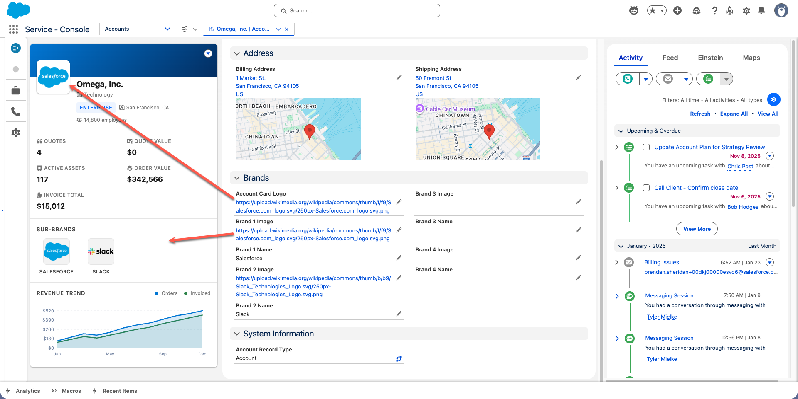

# Modern Account Card

A Revenue Cloud-focused account card Lightning Web Component with real-time metrics from Quotes, Orders, Assets, and Invoices.

## Preview



## Features

- **Company Logo**: Per-account logo from `Account.AccountCardLogo__c` field
- **Account Header**: Logo, name, industry, type, location, employees
- **Real-Time Metrics**: Pulls live data from related records via Apex
- **Fallback Values**: Configurable defaults when no data exists
- **Brand Affinities**: Up to 4 sub-brands per account (custom fields on Account)
- **Revenue Trend Chart**: Dual-line chart with customizable colors
- **Light/Dark Theme**: Configurable theme mode

## Revenue Cloud Metrics

| Metric | Data Source | Description |
|--------|-------------|-------------|
| Quote Count | `COUNT(Quote)` | Number of quotes for the account |
| Quote Value | `SUM(Quote.TotalPrice)` | Total value of all quotes |
| Active Assets | `COUNT(Asset)` | Number of assets for the account |
| Order Value | `SUM(Order.TotalAmount)` | Total value of all orders |
| Invoice Total | `SUM(Invoice.TotalAmount)` | Total invoiced amount |

## Standard Account Fields Displayed

- Name, Industry, Type
- Billing City/State (location)
- Number of Employees

---

## Installation

### Deploy Everything at Once (Recommended)

```bash
sf project deploy start --manifest manifest/package.xml --target-org YOUR_ORG_ALIAS
```

### Post-Installation

1. Assign the **Modern Account Card Access** permission set to users
2. Add the component to Account record pages via Lightning App Builder
3. Configure settings as needed

---

## Configuration

### Component Settings

| Category | Settings |
|----------|----------|
| **Theme** | Light/Dark mode |
| **Header** | Background image URL |
| **Logo** | Logo field on Account, fallback URL, default URL |
| **Metrics** | Show/hide each metric, custom labels, fallback values |
| **Brand Affinities** | Show/hide, section title, fallback values (uses Account.Brand_1-4 fields) |
| **Chart** | Show/hide, title, data, labels, colors |

### Logo Priority

The component uses this priority for displaying the account logo:
1. `Account.AccountCardLogo__c` field (per-account)
2. LWC Setting: "Account Logo URL (Fallback)"
3. LWC Setting: "Default Logo URL"
4. Built-in placeholder SVG

---

## Custom Fields (Account)

| Field API Name | Type | Description |
|----------------|------|-------------|
| `AccountCardLogo__c` | URL | Company logo image URL |
| `Brand_1_Name__c` - `Brand_4_Name__c` | Text | Sub-brand names |
| `Brand_1_Image__c` - `Brand_4_Image__c` | URL | Sub-brand logos |

---

## Package Contents

| Component | Type | Description |
|-----------|------|-------------|
| `modernAccountCard` | LWC | Account card component |
| `ModernAccountCardController` | Apex | Fetches aggregated metrics |
| `Modern_Account_Card_Access` | Permission Set | FLS for Account custom fields |
| 9 Custom Fields | CustomField | Logo and brand fields on Account |

---

## File Structure

```
Modern Account Card/
├── README.md
├── manifest/
│   └── package.xml
└── force-app/
    └── main/
        └── default/
            ├── classes/
            │   ├── ModernAccountCardController.cls
            │   └── ModernAccountCardController.cls-meta.xml
            ├── lwc/
            │   └── modernAccountCard/
            │       ├── modernAccountCard.css
            │       ├── modernAccountCard.html
            │       ├── modernAccountCard.js
            │       └── modernAccountCard.js-meta.xml
            ├── objects/
            │   └── Account/
            │       └── fields/
            │           └── (9 custom field definitions)
            └── permissionsets/
                └── Modern_Account_Card_Access.permissionset-meta.xml
```

---

## Requirements

- Salesforce org with Lightning Experience
- API version 62.0 or higher
- For metrics: Quote, Order, Asset, Invoice objects (Revenue Cloud)

---

## License

Provided as-is for demonstration purposes.
