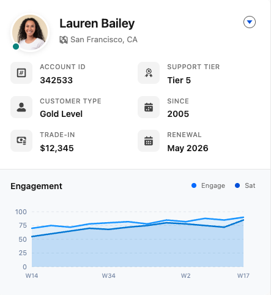

# Modern Contact Card LWC

A modern, customizable Lightning Web Component for displaying contact information with a sleek design following SLDS 2 standards.

## Preview



## Features

- **Header Background Banner**: Gradient background with optional custom image from Contact field
- **Dynamic Contact Data**: Automatically retrieves contact information from related records (Contact, Case, MessagingSession, VoiceCall)
- **Health Score Pill**: Color-coded health indicator (red/orange/yellow/green based on score 0-100)
- **Contact Tags**: Comma-separated tags displayed as colorful pills
- **Light/Dark Theme Toggle**: Configurable theme mode via Lightning App Builder
- **Customizable Metrics**: 6 configurable data fields with labels, icons, and visibility toggles
- **Profile Image from Contact Field**: Wire profile images to a custom URL field on the Contact record
- **Interactive Chart**: Built-in engagement/satisfaction chart with customizable data
- **Action Menu**: Quick actions for View Details, Edit Contact, and Send Email
- **SLDS 2 Compliant**: Modern styling using Salesforce Lightning Design System variables
- **Responsive Design**: Adapts to container width

## Installation

### Deploy the Component

```bash
sf project deploy start --source-dir "force-app/main/default/lwc/modernContactCard" --target-org YOUR_ORG_ALIAS
```

### Deploy Custom Fields

The component uses custom fields on the Contact object for profile images, background, health score, tags, and metric data:

```bash
sf project deploy start --source-dir "force-app/main/default/objects/Contact/fields" --target-org YOUR_ORG_ALIAS
```

## Custom Fields

| Field API Name | Type | Description |
|----------------|------|-------------|
| `ContactCardPicture__c` | URL | Profile image URL for the contact |
| `ContactCardBackground__c` | URL | Header background image URL |
| `ContactCardHealthScore__c` | Number | Customer health score (0-100) |
| `ContactCardTags__c` | Text | Comma-separated tags (e.g., "VIP, Decision Maker") |
| `Metric_1__c` | Text(255) | Value for metric field 1 |
| `Metric_2__c` | Text(255) | Value for metric field 2 |
| `Metric_3__c` | Text(255) | Value for metric field 3 |
| `Metric_4__c` | Text(255) | Value for metric field 4 |
| `Metric_5__c` | Text(255) | Value for metric field 5 |
| `Metric_6__c` | Text(255) | Value for metric field 6 |

## Configuration

The component is highly configurable through Lightning App Builder properties:

### Theme Settings
- **Theme Mode**: Choose between "Light" or "Dark" theme

### Header Background Settings
- **Background Image Field**: API name of Contact field for background image (default: `ContactCardBackground__c`)
- **Default Background URL**: Fallback URL if Contact field is empty (leave empty for gradient)

### Profile Image Settings
- **Profile Image Field**: API name of the Contact field containing the image URL (default: `ContactCardPicture__c`)
- **Fallback Image URL**: URL to display if the Contact field is empty

### Health Score Settings
- **Health Score Field**: API name of Contact field for health score (default: `ContactCardHealthScore__c`)
- **Health Score Label**: Label displayed before score (default: "Health")
- **Health Score Fallback**: Fallback value if Contact field is empty
- **Show Health Score**: Toggle visibility

Health score colors automatically adjust based on value:
- **0-30**: Red to Orange
- **31-50**: Orange to Yellow
- **51-70**: Yellow to Light Green
- **71-100**: Light Green to Green

### Tags Settings
- **Tags Field**: API name of Contact field for tags (default: `ContactCardTags__c`)
- **Fallback Tags**: Comma-separated fallback tags
- **Show Tags**: Toggle visibility

### Metric Field Settings (x6)
Each metric field has:
- **Label**: The header text (e.g., "ACCOUNT ID")
- **Icon**: SLDS icon name (e.g., `utility:number_input`)
- **Value**: Fallback value if `Contact.Metric_X__c` is empty
- **Show Field**: Toggle visibility

### Chart Settings
- **Chart Title**: Title displayed above the chart (default: "CSAT History")
- **Engagement Data**: Comma-separated values for the engagement line
- **Satisfaction Data**: Comma-separated values for the satisfaction line
- **Chart Labels**: Comma-separated x-axis labels

## Supported Record Pages

The component can be placed on:
- **Contact** record pages
- **Case** record pages (retrieves contact from `ContactId`)
- **MessagingSession** record pages (retrieves contact from `EndUserContactId`)
- **VoiceCall** record pages (retrieves contact from `Contact__c`)

## Usage

1. Navigate to a supported record page in Lightning App Builder
2. Drag the "Modern Contact Card" component onto the page
3. Configure the component properties as needed
4. Save and activate the page

## File Structure

```
Modern Contact Card/
├── README.md
├── assets/
│   └── preview.png
└── force-app/
    └── main/
        └── default/
            ├── lwc/
            │   └── modernContactCard/
            │       ├── modernContactCard.css
            │       ├── modernContactCard.html
            │       ├── modernContactCard.js
            │       └── modernContactCard.js-meta.xml
            └── objects/
                └── Contact/
                    └── fields/
                        ├── ContactCardBackground__c.field-meta.xml
                        ├── ContactCardHealthScore__c.field-meta.xml
                        ├── ContactCardPicture__c.field-meta.xml
                        ├── ContactCardTags__c.field-meta.xml
                        ├── Metric_1__c.field-meta.xml
                        ├── Metric_2__c.field-meta.xml
                        ├── Metric_3__c.field-meta.xml
                        ├── Metric_4__c.field-meta.xml
                        ├── Metric_5__c.field-meta.xml
                        └── Metric_6__c.field-meta.xml
```

## Requirements

- Salesforce org with Lightning Experience enabled
- API version 62.0 or higher
- For VoiceCall support: Custom `Contact__c` lookup field on VoiceCall object

## License

This component is provided as-is for demonstration purposes.
