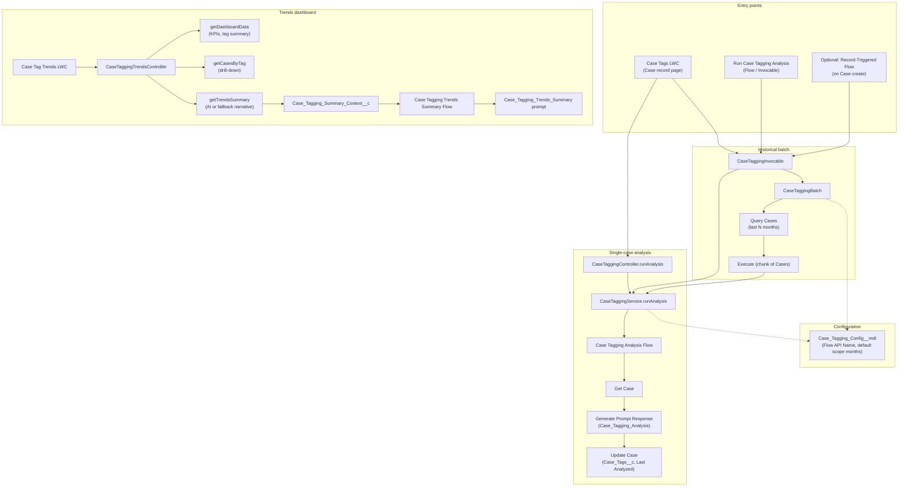

# Case Tagging

AI-powered **case tagging** for Service Cloud: analyze Case subject, description, type, priority, origin, and status with Einstein GenAI to produce comma-separated tags (e.g. criticality, category). Tags are stored on the Case and can be edited manually. Includes a **Case Tag Trends** dashboard (tag volume, top tags, AI-generated or fallback narrative) and optional historical batch backfill.

**Requires:** Service Cloud (Case), Einstein GenAI (API 65.0+). Custom fields on Case and custom metadata are included.

---

## How It Works



### Flow summary

1. **Case Tags LWC** (on Case record page): User can run analysis for the current case, add/remove tags manually, or start a **historical** run for cases in the last N months.
2. **Run Case Tagging Analysis** (Invocable): Callable from Flows and other automation. Pass **Case IDs** for immediate analysis, or **Historical Scope (Months)** to enqueue a batch job.
3. **Case Tagging Service** invokes the autolaunched **Case Tagging Analysis Flow** with a Case ID. The flow gets the Case, calls the **Case_Tagging_Analysis** GenAI prompt template, and updates the Case with `Case_Tags__c` and `Case_Tags_Last_Analyzed_Date__c`.
4. **Historical batch**: `CaseTaggingBatch` queries Cases created in the last N months (from config or invocable input), processes them in chunks, and runs the same flow per case.
5. **Case Tag Trends** LWC: Shows KPIs (cases tagged, unique tags, scope), top tags with counts, and a “Generate summary” action that builds tag summary text, creates a context record, and runs **Case Tagging Trends Summary Flow** (GenAI) for a short narrative—or uses an Apex fallback if the flow/prompt are unavailable.
6. **Case Tagging Config** (custom metadata) stores the Flow API Name and default historical scope in months.

---

## What’s in the package

| Asset | Description |
|-------|-------------|
| **Apex** | `CaseTaggingService`, `CaseTaggingController`, `CaseTaggingInvocable`, `CaseTaggingBatch`, `CaseTaggingTrendsController` (+ tests) |
| **Flows** | `Case_Tagging_Analysis_Flow` (autolaunched), `Case_Tagging_Trends_Summary_Flow` (autolaunched) |
| **GenAI** | `Case_Tagging_Analysis`, `Case_Tagging_Trends_Summary`, `Case_Summarizer` |
| **LWCs** | `caseTags` (Case record page), `caseTagTrends` (dashboard/tab) |
| **Custom metadata** | `Case_Tagging_Config__mdt` (e.g. Case_Tagging_Default) |
| **Case fields** | `Case_Tags__c`, `Case_Tags_Last_Analyzed_Date__c` |
| **Custom object** | `Case_Tagging_Summary_Context__c` (for trends summary input) |

---

## Deployment

From the **Case Tagging** package directory (e.g. `Service Cloud/Case Tagging` in Demo-Lab):

```bash
sf project deploy start --source-dir "Service Cloud/Case Tagging"
```

Or deploy the `force-app` directory of this project and include the manifest if using a custom `package.xml`.

---

## Post-deploy setup

See **[SETUP.md](./SETUP.md)** for:

- Confirming the Case Tagging Analysis Flow and prompt template
- Optional record-triggered flow so new cases are tagged on create
- Adding the **Case Tags** LWC to the Case record page and **Case Tag Trends** to a tab or app page
- Configuring default historical scope (custom metadata)
- Running a one-time historical backfill and troubleshooting

---

## Quick reference

| Item | API name / value |
|------|-------------------|
| Autolaunched flow (analysis) | `Case_Tagging_Analysis_Flow` |
| Input variable (flow) | `CaseId` |
| Invocable | Run Case Tagging Analysis |
| Config (custom metadata) | Case Tagging Default |
| Case tags field | `Case_Tags__c` |
| LWCs | `caseTags`, `caseTagTrends` |

---

## Disclaimer

This package is for **demos and labs** only. Do not use in production without review and testing.
