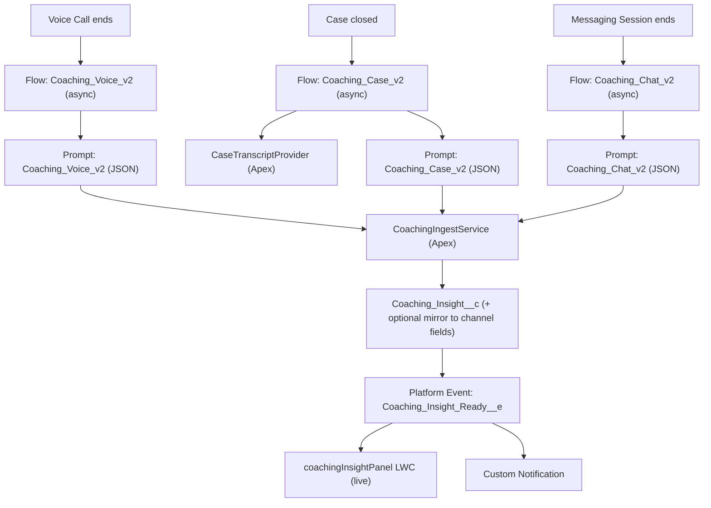

# Coaching Intelligence

AI-powered agent coaching and customer sentiment for Service Cloud, delivered **in real time the moment an interaction closes** — across **Voice**, **Chat**, and **Case** channels.

When a Voice Call ends, a Messaging Session closes, or a Case is closed, a record-triggered flow asynchronously runs a generative-AI prompt over the conversation, parses a structured result, writes a unified `Coaching_Insight__c` record, and pushes the result live to the agent's screen via a Platform Event (no refresh button) plus a custom notification.

---

## Why this exists

This is a v2 re-architecture of the common "Agent Performance + Sentiment" demo (which wrote free-text LLM output straight onto Voice Call / Messaging Session fields and parsed it with brittle `indexOf()` string matching). v2 keeps the good parts and fixes the rest:

| Concern | v1 pattern | v2 (this package) |
|---|---|---|
| Parsing | `indexOf('Rating Score:')` string scraping | Strict-JSON prompt output + single typed parser |
| Storage | Overwrites fields on the channel record | Unified `Coaching_Insight__c` (history, trends, per-agent rollups) + optional mirror to channel fields |
| Delivery | Manual "Refresh" button | Live push via Platform Event + `lightning/empApi` + custom notification |
| Channels | Voice + Chat only | Voice + Chat + **Case** (new) |
| Sprawl | 8 flows + 3 near-duplicate Apex extractors | 1 ingest service + thin per-channel flows |
| Governance | None | Model, prompt version, latency, status, and error captured on every run |

---

## Architecture



Data flow: **close -> async flow -> prompt (JSON) -> parse + persist -> event -> live UI**.

---

## What gets installed

### Core (installs in any org)
- **`Coaching_Insight__c`** custom object — one record per evaluation. Channel-agnostic: a generic `Related_Record_Id__c` (+ `Related_Record_Type__c`) plus a native `Related_Case__c` lookup. Captures performance rating, evaluation, sentiment rating/narrative, per-category JSON, and governance fields (model, prompt version, latency, analysis type, status, error).
- **`Coaching_Insight_Ready__e`** platform event — fired when an analysis completes.
- **Apex**
  - `CoachingResult` — typed wrapper + tolerant JSON parsing.
  - `CoachingIngestService` — `@InvocableMethod` engine: parse -> persist -> mirror (dynamic, only if the channel object/fields exist) -> publish event -> send notification. Bulk-safe and fault-tolerant.
  - `CoachingInsightController` — read API for the LWC.
  - `CaseTranscriptProvider` — assembles an `Agent:/End User:` transcript for a Case from its description, emails, and comments.
  - Full test classes for each.
- **`Coaching_Case_v2`** prompt template (strict JSON) + **`Coaching_Case_v2`** flow (triggers on Case close).
- **`coachingInsightPanel`** LWC — live, no-refresh panel (subscribes via `lightning/empApi`). Add it to any record page.
- **`Coaching_Insight_Ready`** custom notification type.
- **`Coaching_Intelligence_Access`** permission set.

### Optional Voice/Chat add-on (`optional/voice-chat/`)
Requires **Service Cloud Voice** and **Enhanced Messaging**, and the v1 coaching fields on `VoiceCall` / `MessagingSession`.
- **`Coaching_Voice_v2`** and **`Coaching_Chat_v2`** prompt templates + flows.
- **`Coaching_Intelligence_VoiceChat_Access`** permission set (FLS for the v1 mirror fields).

> The core engine mirrors results back onto `VoiceCall` / `MessagingSession` fields **only if those objects and fields exist** in the org — so the core deploys cleanly everywhere, and Voice/Chat "just works" once the add-on and its prerequisites are present.

---

## Prerequisites

- **Salesforce CLI** (`sf`) installed and authenticated to your target org. [Install guide](https://developer.salesforce.com/tools/salesforcecli).
- **Einstein Generative AI / Prompt Builder** enabled (Setup -> Einstein Setup / Einstein Generative AI).
- **Case channel** works on any Service Cloud org out of the box.
- **Voice channel** (optional add-on): Service Cloud Voice enabled; the v1 `VoiceCall` coaching fields present.
- **Chat channel** (optional add-on): Enhanced Messaging enabled; the v1 `MessagingSession` coaching fields present.
- The Voice/Chat prompts read the conversation via the platform transcript providers `conv_sum_vc__GetTscpForVoiceCall` / `conv_sum_ms__GetTscpForMsgSession` (delivered with the conversation-summary feature). These must exist in the org for the Voice/Chat add-on.

---

## Install

From this folder:

```bash
# Core only (any org) — deploys and assigns the permission set to you
./install.sh --target-org MyOrgAlias

# Core + Voice/Chat add-on (Service Cloud Voice + Enhanced Messaging orgs)
./install.sh --target-org MyOrgAlias --with-voice-chat
```

Useful flags:
- `-o, --target-org <alias|username>` — target org (defaults to your `sf` default org).
- `--with-voice-chat` — also deploy the Voice/Chat prompts, flows, and FLS permission set.
- `--no-assign` — deploy without assigning permission sets.
- `-l, --test-level <level>` — passed through to `sf project deploy start` (e.g. `RunLocalTests` for production).
- `-h, --help`.

### Manual install (without the script)

```bash
# core
sf project deploy start --source-dir force-app --target-org MyOrgAlias
sf org assign permset --name Coaching_Intelligence_Access --target-org MyOrgAlias

# optional voice/chat
sf project deploy start --source-dir optional/voice-chat/force-app --target-org MyOrgAlias
sf org assign permset --name Coaching_Intelligence_VoiceChat_Access --target-org MyOrgAlias
```

---

## Post-install steps

1. **Add the panel to your record pages.** In the Lightning App Builder, edit the record page for Case (and Voice Call / Messaging Session if applicable) and drop in the **Coaching Insight Panel** component.
2. **Confirm notifications.** The `Coaching Insight Ready` custom notification type is created; make sure your users have notifications enabled.
3. **Try it.** Close a Case (or end a Voice Call / Messaging Session). Within a few seconds a `Coaching_Insight__c` record is created and the panel updates live.

---

## How it works

1. A record-triggered flow fires asynchronously (`AsyncAfterCommit`) when the interaction closes — so the agent's save is never blocked.
2. The flow runs the channel's prompt template, which returns a single strict-JSON object:
   ```json
   {
     "performanceRating": 7,
     "categories": { "agentProcess": "...", "customerFocus": "...", "softSkills": "...", "toneLanguageClarity": "...", "professionalConduct": "..." },
     "summary": "...",
     "sentimentRating": "Positive",
     "sentimentNarrative": "..."
   }
   ```
3. `CoachingIngestService` parses it, writes a `Coaching_Insight__c`, mirrors the latest result onto the channel record (if those fields exist), publishes `Coaching_Insight_Ready__e`, and sends a custom notification.
4. The `coachingInsightPanel` LWC is subscribed to the event and refreshes instantly.

For Case, `CaseTranscriptProvider` first assembles a transcript from the case description, email thread, and comments (since Case has no platform transcript provider).

---

## Uninstall

```bash
# remove permission set assignments first, then delete components via a destructiveChanges deployment
sf project delete source --metadata "CustomObject:Coaching_Insight__c" --target-org MyOrgAlias
```
Delete the flows, prompt templates, Apex classes, LWC, custom tab, notification type, and permission sets the same way (or with a `destructiveChanges.xml`).

---

## Notes & limitations

- LLM output is non-deterministic; the prompts instruct strict JSON and the parser is tolerant of wrapping prose/code fences, but always review coaching content before sharing externally.
- Sentiment is mapped to a restricted picklist (`Positive` / `Neutral` / `Negative`); unmappable values are stored as blank rather than failing the run.
- The Voice/Chat channels depend on Service Cloud Voice / Enhanced Messaging and the conversation-summary transcript providers; the Case channel has no such dependency.
