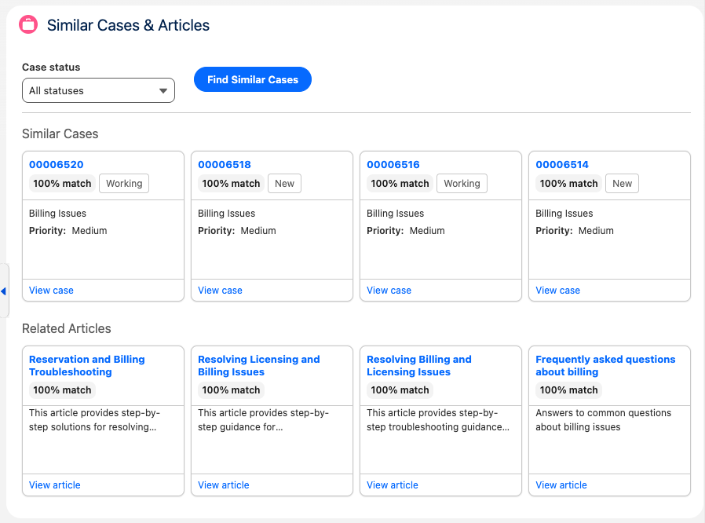

# Similar Cases & Articles

A Service Cloud Lightning Web Component for the **Case** record page that helps reps find similar cases and related Knowledge articles. Uses **Einstein Models API** (Gen AI) to score case similarity and dynamic SOSL for related articles, displayed in a compact 4-wide card grid with relevancy scores.

**Do not use in production.** For demos and evaluation only.

## Preview



## Features

- **Similar Cases**: Candidate cases (same Account or Type) are sent to the Models API; the model returns case IDs and a relevancy score (0–100). Shown in a 4-wide card grid with Case Number, Type, Priority, Reason, Status, and “View case” link.
- **Status Filter**: Combobox to restrict similar cases by status (All, New, Working, Escalated, Closed).
- **Related Articles**: SOSL search on the case Subject against Knowledge (e.g. `Knowledge__kav`). Articles get a keyword-based relevance score and appear in the same card layout with “View article” link. Assumes the installation org has Knowledge configured; no package dependency on Knowledge.
- **Layout**: Responsive 4-column grid (2 on tablet, 1 on small screens). Compact cards for the middle column of a Case record page.

## What It Uses

| Capability | Description |
|------------|-------------|
| Similar cases | Einstein Models API `createGenerations` (prompt built in Apex) |
| Related articles | Dynamic SOSL via `Search.query()` (object name in code; no static Knowledge dependency) |
| Relevancy scores | Model returns 0–100 for cases; keyword overlap for articles |

---

## How it works

1. **User action**  
   On a Case record page, the rep optionally selects a **Case status** filter (e.g. Closed) and clicks **Find Similar Cases**. The LWC calls Apex with the current case Id, the chosen filter, and the configured max results (similar cases and related articles).

2. **Similar cases (Gen AI)**  
   - The service loads the **current case** (Subject, Description, Account, Type, etc.).  
   - It fetches **candidate cases**: up to 30 other Cases that share the same **Account** (or, if no Account, the same **Type**), optionally filtered by status, ordered by last modified.  
   - It builds a **text prompt** that describes the current case and lists each candidate (Id, Number, Subject, Description).  
   - It calls the **Einstein Models API** (`createGenerations`) with that prompt and asks the model to return a JSON array of the most relevant case IDs with a relevancy score (0–100).  
   - The response is parsed, matched back to the candidate cases, sorted by score, and trimmed to the configured **max similar cases** (default 10, max 20).  
   - The LWC displays these in a card grid with Case Number, Type, Priority, Reason, Status, and a “View case” link.

3. **Related articles (SOSL)**  
   - The service takes the current case **Subject**, cleans it (removes special characters, stop words), and splits it into search terms.  
   - It runs **one SOSL search per term** against `Knowledge__kav` (e.g. `FIND {"billing*"}`, `FIND {"discrepancy*"}`) so that any article matching any term can be found. Results are merged and de-duplicated by article Id.  
   - Each article is scored for relevance using the case subject: how many subject words appear in the article title/summary, plus the search term that returned the article (so the score reflects why the article was found).  
   - Articles are sorted by that score, limited to the configured **max related articles** (default 10, max 20), and returned.  
   - The LWC shows them in the same card style with title, summary, relevance %, and “View article” link.

4. **Display**  
   The component shows the two sections in order: **Similar Cases** then **Related Articles**, each in a responsive 4-column grid (fewer columns on smaller screens). Relevancy/relevance percentages are shown on each card.

---

## Installation

### Option 1: Package Install (Recommended when available)

```
https://login.salesforce.com/packaging/installPackage.apexp?p0=04tKj000000fTE0IAM
```

> **Note:** During Salesforce release windows, package installation may show "Mismatching Versions" if your org hasn't been upgraded yet. Use Option 2 below as an alternative.

### Option 2: Deploy via CLI

See **[INSTALL.md](INSTALL.md)** for detailed step-by-step instructions including:
- Installing Salesforce CLI
- Authenticating to your org
- Deploying the component
- Adding the component to the Case record page

**Quick deploy:**
```bash
git clone https://github.com/sfdc-brendan/Demo-Lab.git
cd Demo-Lab/Service\ Cloud/Similar\ Cases
sf org login web --alias my-org --set-default
sf project deploy start --source-dir force-app --target-org my-org
```

### Post-Installation

1. Add **Similar Cases & Articles** to the Case record page via Lightning App Builder (see [INSTALL.md](INSTALL.md) Step 4).
2. Open a Case record, choose an optional **Case status** filter, and click **Find Similar Cases**.
3. No permission set is required; Apex runs with sharing.

---

## Package Contents

| Component | Type | Description |
|-----------|------|-------------|
| `similarCasesAndArticles` | LWC | Case record page component (filter + cards) |
| `SimilarCasesController` | Apex | Exposes `getSimilarCasesWithScores(recordId, statusFilter)` |
| `SimilarCasesService` | Apex | Fetches candidates, calls Models API, runs SOSL for articles |
| `SimilarCasesServiceTest` | Apex | Test class |

---

## File Structure

```
Similar Cases/
├── README.md
├── INSTALL.md
├── sfdx-project.json
├── assets/
│   └── similar-cases-screenshot.png
└── force-app/
    └── main/
        └── default/
            ├── classes/
            │   ├── SimilarCasesController.cls
            │   ├── SimilarCasesController.cls-meta.xml
            │   ├── SimilarCasesService.cls
            │   ├── SimilarCasesService.cls-meta.xml
            │   ├── SimilarCasesServiceTest.cls
            │   └── SimilarCasesServiceTest.cls-meta.xml
            └── lwc/
                └── similarCasesAndArticles/
                    ├── similarCasesAndArticles.html
                    ├── similarCasesAndArticles.js
                    ├── similarCasesAndArticles.js-meta.xml
                    └── similarCasesAndArticles.css
```

---

## Requirements

- Salesforce org with Lightning Experience, API 65.0+
- **Einstein / Gen AI**: Models API enabled (e.g. Einstein 1 Edition or add-on). The component uses `aiplatform.ModelsAPI.createGenerations()` with a default model (e.g. `sfdc_ai__DefaultGPT41`).
- **Case** object (standard).
- **Knowledge (optional)**: For related articles, the installation org should have Salesforce Knowledge configured. The code uses a configurable article type (default `Knowledge__kav`). No package dependency on Knowledge.

---

## License

Provided as-is for demonstration purposes.
