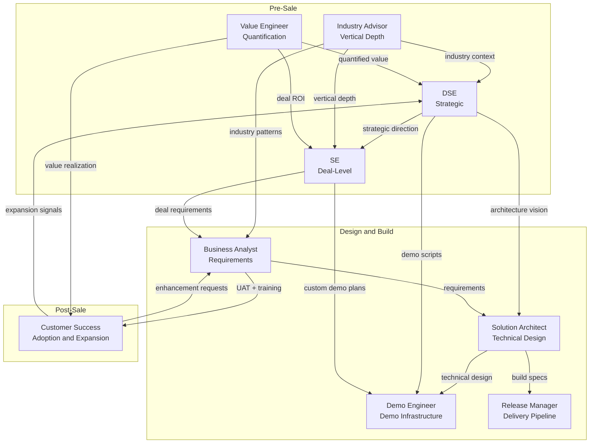

# Salesforce Subagent Library

A complete suite of AI skills for **Cursor** and **Claude Code** covering the full Salesforce solutions selling and delivery lifecycle — from strategic positioning through implementation to customer success.

---

## Install Everything

**One command installs all 9 subagents:**

```bash
curl -fsSL https://raw.githubusercontent.com/sfdc-brendan/Demo-Lab/main/subagents/install-all.sh | bash -s -- --both
```

Or pick your platform:

```bash
# Cursor only
curl -fsSL https://raw.githubusercontent.com/sfdc-brendan/Demo-Lab/main/subagents/install-all.sh | bash -s -- --cursor

# Claude Code only
curl -fsSL https://raw.githubusercontent.com/sfdc-brendan/Demo-Lab/main/subagents/install-all.sh | bash -s -- --claude
```

To install a single subagent, see the README in its folder.

---

## The Subagents

### Pre-Sale

| Subagent | Skill Name | What It Does |
|---|---|---|
| [Distinguished Solutions Engineer](DSE/) | `sf-dse` | Strategic advisor operating at OU/segment level. Executive briefings, GTM plays, POVs, strategic demo scripts. Presents alongside SVPs. |
| [Solutions Engineer](SE/) | `sf-se` | Deal-level technical win. Discovery prep, custom demos, competitive battle cards, POC scoping, objection handling. |
| [Industry Advisor](IndustryAdvisor/) | `sf-industry-advisor` | Vertical expertise force multiplier. Industry process maps, regulatory compliance, terminology, benchmarks. Enriches every other role. |
| [Value Engineer](ValueEngineer/) | `sf-value-engineer` | Business case quantification. ROI models, TCO comparisons, cost-of-inaction analysis, value realization tracking. |

### Design and Build

| Subagent | Skill Name | What It Does |
|---|---|---|
| [Solution Architect](SA/) | `sf-sa` | Technical design. Solution design docs, data models, integration architecture, build-vs-buy analysis, environment strategy. |
| [Business Analyst](BA/) | `sf-ba` | Requirements lifecycle. User stories, process maps, acceptance criteria, UAT plans, training materials, backlog triage. |
| [Demo Engineer](DemoEngineer/) | `sf-demo-engineer` | Demo infrastructure. Org setup scripts, persona data, reset procedures, environment runbooks. Makes demos work. |
| [Release Manager](ReleaseManager/) | `sf-release-manager` | Delivery pipeline. CI/CD design, deployment checklists, rollback procedures, change management, release cadence. |

### Post-Sale

| Subagent | Skill Name | What It Does |
|---|---|---|
| [Customer Success](CustomerSuccess/) | `sf-customer-success` | Post-sale relationship. Success plans, adoption scorecards, health checks, QBR decks, expansion mapping, risk mitigation. |

---

## How They Work Together



### Quick Reference: Who Leads What

| Activity | Primary | Supports | Consulted |
|---|---|---|---|
| Executive engagement | DSE | SE, Value Engineer | Industry Advisor |
| Deal-level technical win | SE | DSE, Demo Engineer | SA, Industry Advisor |
| Industry context | Industry Advisor | — | DSE, BA, SA, SE |
| Business case / ROI | Value Engineer | DSE, SE | BA |
| Technical design | SA | — | BA, DSE |
| Requirements | BA | SA | SE, Industry Advisor |
| Demo environment | Demo Engineer | — | DSE, SE |
| Deployment | Release Manager | — | SA, BA |
| Post-sale adoption | Customer Success | BA | DSE, Value Engineer |

---

## Install Paths

| Platform | Location |
|---|---|
| Cursor | `~/.cursor/skills/[skill-name]/` |
| Claude Code | `~/.claude/skills/[skill-name]/` |

Each subagent installs to its own directory (e.g., `~/.cursor/skills/sf-dse/`, `~/.cursor/skills/sf-ba/`, etc.).

---

## Individual Install

Each subagent can be installed independently:

```bash
# Example: install just the DSE
curl -fsSL https://raw.githubusercontent.com/sfdc-brendan/Demo-Lab/main/subagents/DSE/install.sh | bash -s -- --both

# Example: install just the BA
curl -fsSL https://raw.githubusercontent.com/sfdc-brendan/Demo-Lab/main/subagents/BA/install.sh | bash -s -- --both
```

See each subagent's README for details.

---

## Scoring

Every subagent includes a 100-point scoring rubric for its deliverables. Ask for a score with:

> "Score this against the [role] rubric."

| Subagent | Scoring Focus |
|---|---|
| DSE | Strategic Framing, Architecture Breadth, Reusability, Executive Communication, Actionability |
| BA | Completeness, Clarity, Business Alignment, Platform Awareness, Testability |
| SA | Technical Soundness, Platform Alignment, Scalability, Maintainability, Documentation Quality |
| SE | Customer Relevance, Technical Credibility, Competitive Awareness, Demo Narrative, Deal Progression |
| Demo Engineer | Reliability, Reset Speed, Data Realism, Automation Coverage, Documentation Clarity |
| Industry Advisor | Industry Accuracy, Regulatory Awareness, Terminology Precision, KPI Relevance, Actionability |
| Value Engineer | Quantitative Rigor, Methodology Transparency, Industry Relevance, Executive Readiness, Conservatism |
| Release Manager | Process Reliability, Automation Coverage, Risk Mitigation, Stakeholder Communication, Repeatability |
| Customer Success | Customer Centricity, Actionability, Data-Driven Insight, Risk Management, Expansion Awareness |

---

## Updating

Re-run the master installer to update all subagents:

```bash
curl -fsSL https://raw.githubusercontent.com/sfdc-brendan/Demo-Lab/main/subagents/install-all.sh | bash -s -- --both
```

---

## Uninstalling

```bash
# Remove all — Cursor
for skill in sf-dse sf-ba sf-sa sf-se sf-demo-engineer sf-industry-advisor sf-value-engineer sf-release-manager sf-customer-success; do
  rm -rf ~/.cursor/skills/$skill
done

# Remove all — Claude Code
for skill in sf-dse sf-ba sf-sa sf-se sf-demo-engineer sf-industry-advisor sf-value-engineer sf-release-manager sf-customer-success; do
  rm -rf ~/.claude/skills/$skill
done
```

---

## Compatibility

| Platform | Status |
|---|---|
| Cursor (any version with skills) | Supported |
| Claude Code (any version with skills) | Supported |

The `SKILL.md` format is identical for both platforms. Only the install directory differs.
